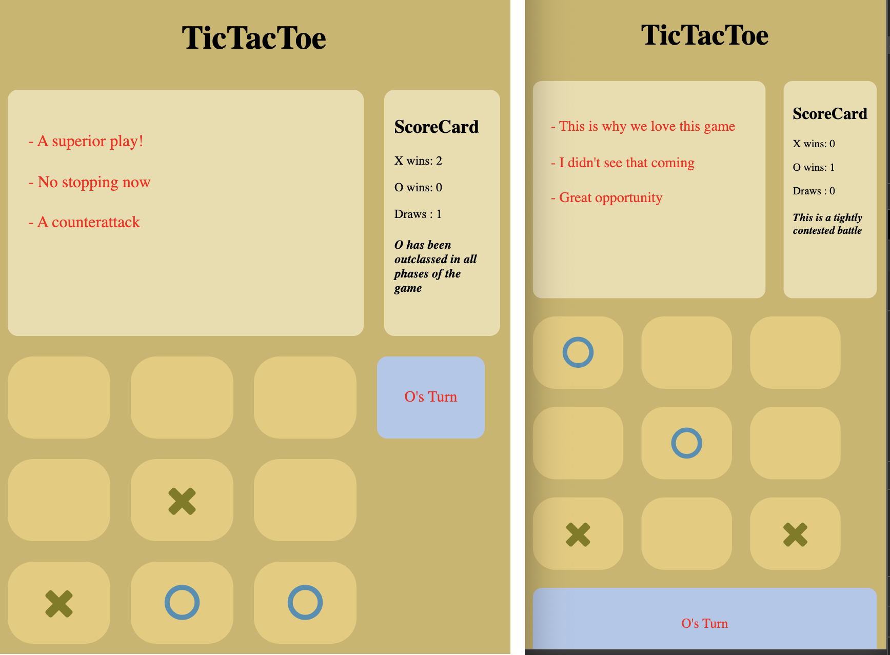

<h1 align="center">Tic Tac Toe</h1>

A fun twist on a an all-time classic game.  
Tic tac toe is a two player html game where you and your opponent take turns until one of you has three in a row.  

This game is a must have for anyone who:
* Has always wanted a way to play tic tac toe while on-the-go
* is sick-and-tired of using costly natural resources to play their favorite game
* has an adventurous spirt and wants to play **_different_**

<h2 align="center">Full vs Mobile Comparison</h2>

## Current Features
- Players can locally battle head-to-head in Tic Tac Toe
- Select who starts each round
- Score card keeps running match totals and privides scenario-based analysis
- Each move results in random commentary
- No refresh required to start new game
- Responsive design for mobile or desktop

## Installation
- nothing to install

## Technologies Used
- html, javascript, css

## Contribute
- Source code: https://github.com/alauson5017/tic-tac-toe
- Issue Tracker: https://github.com/alauson5017/tic-tac-toe/issues